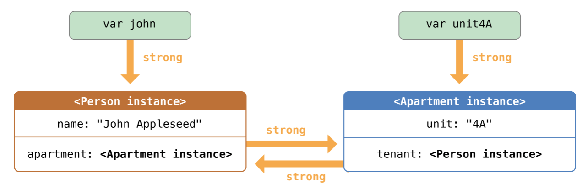
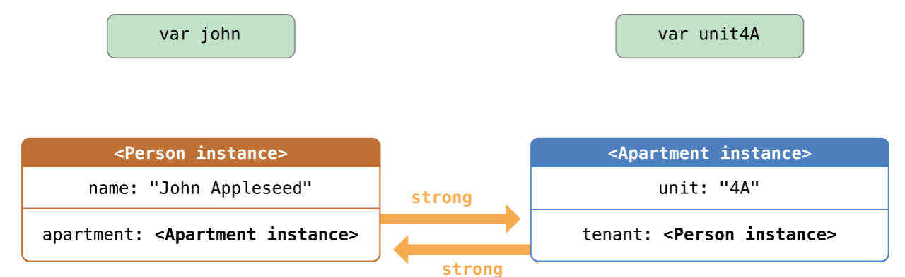
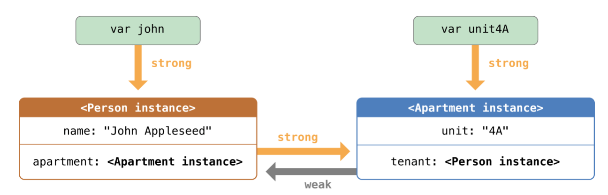
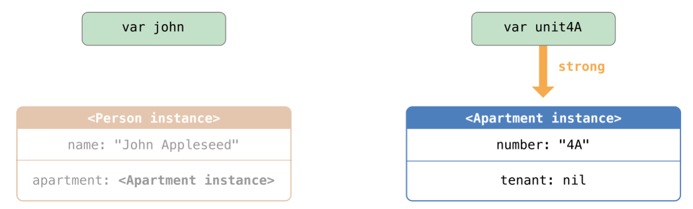
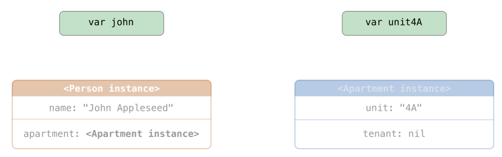

# Strong Reference Cycle

| 질문출처 | 작성자 |
| :------- | :----: |
| 룩핀     |  썽니  |

## Question

- 객체 간 순환참조를 발견하는 방법과 해결 방법은?

## Simple Answer

- 인스턴스의 참조카운트가 절대로 0이 되지 않는 경우. 즉, 두 인스턴스가 서로를 강하게 참조하고 있을 때 순환 참조가 발생함
- 순환 참조가 발생하면 두 인스턴스는 메모리 상에 계속 존재하기 때문에 memory leak이 발생하는데, Xcode의 메모리 그래프 디버거를 통해 memory leak을 찾아낼 수 있음.
- 해결방법: 인스턴스간 참조 관계를 강한 참조가 아닌 `weak` 또는 `unowned` 참조로 바꿔주어야 함.
  - weak vs. unowned에 대한 정보는 [strong, weak, unowned](reference.md)

#### - Sample Code

- Strong Reference Cycles Between Class Instances

```swift
class Person {
    let name: String
    var apartment: Apartment?

    init(name: String) { self.name = name }
    deinit { print("\(name) is being deinitialized") }
}

class Apartment {
    let unit: String
    var tenant: Person?

    init(unit: String) { self.unit = unit }
    deinit { print("Apartment \(unit) is being deinitialized") }
}

var john: Person? = Person(name: "John Appleseed")
var unit4A: Apartment? = Apartment(unit: "4A")

john!.apartment = unit4A
unit4A!.tenant = john
// 두 인스턴스의 프로퍼티 변수 간에 강한 상호참조 발생 (Strong Reference Cycle)
```



```swift
john = nil
unit4A = nil
// 메모리 사이클 발생 시 프로퍼티 간 상호참조 때문에 두 인스턴스를 모두 nil로 해도 deallocation 되지 않음
// deinit 호출되지 않음
```



- Resolving Strong Reference Cycles Between Class Instances

```swift
class Person {
    let name: String
    var apartment: Apartment?

    init(name: String) { self.name = name }
    deinit { print("\(name) is being deinitialized") }
}

class Apartment {
    let unit: String
    weak var tenant: Person? // tenant 변수를 weak 키워드로 설정

    init(unit: String) { self.unit = unit }
    deinit { print("Apartment \(unit) is being deinitialized") }
}

var john: Person?
var unit4A: Apartment?

john = Person(name: "John Appleseed")
unit4A = Apartment(unit: "4A")

john!.apartment = unit4A
unit4A!.tenant = john
```



```swift
john = nil
// Prints "John Appleseed is being deinitialized"
```



```swift
unit4A = nil
// Prints "Apartment 4A is being deinitialized"
```



## Links

- [Swift Docs - Strong Reference Cycles Between Class Instances](https://docs.swift.org/swift-book/LanguageGuide/AutomaticReferenceCounting.html)
- [ㄴ 한글 번역](https://rhammer.tistory.com/139?category=553762)
